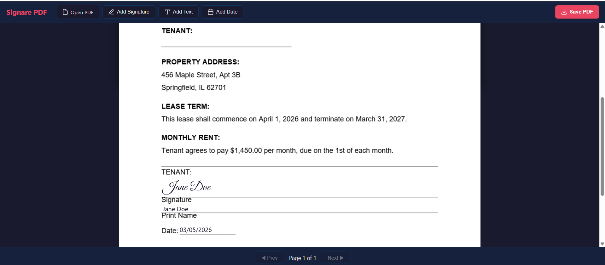

# Signare PDF

A free, client-side PDF signing tool that runs entirely in your browser. No uploads, no servers, no accounts. Your documents never leave your machine.

## Features

- **Signature fields** - Type your name and choose from 4 cursive font styles (Dancing Script, Great Vibes, Sacramento, Pacifico)
- **Text fields** - Add free text anywhere on the document (double-click to edit)
- **Date stamps** - Auto-filled with today's date, editable
- **Drag and drop** - Load PDFs by dragging them onto the page
- **Multi-page support** - Navigate between pages and place fields on any page
- **Draggable fields** - Position fields exactly where you need them
- **WYSIWYG save** - What you see on screen is what you get in the saved PDF

## How to Use

1. Open `index.html` in your browser (or visit the [live demo](https://crenshawm.github.io/signare-pdf/))
2. Click **Open PDF** or drag a PDF file onto the page
3. Use the toolbar to add signatures, text, or dates
4. Drag fields to position them
5. Double-click any field to edit its text
6. Click **Save PDF** to download the signed document

## Privacy

Everything runs 100% client-side in your browser. Your PDF files are never uploaded to any server. The only external requests are for loading fonts (Google Fonts) and libraries (CDN-hosted JavaScript).

## Technology

Single HTML file (~530 lines) using:

- [PDF.js](https://mozilla.github.io/pdf.js/) - PDF rendering
- [pdf-lib](https://pdf-lib.js.org/) - PDF modification and saving
- [html2canvas](https://html2canvas.hertzen.com/) - Pixel-perfect DOM capture for saving
- [Google Fonts](https://fonts.google.com/) - Cursive signature fonts

## License

MIT
